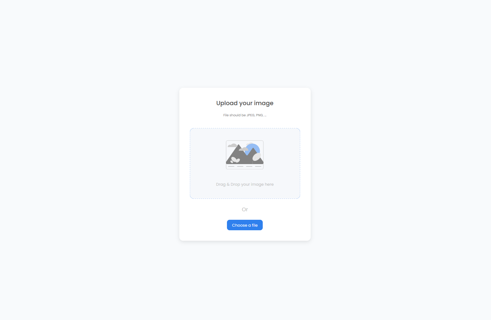

<!-- Please update value in the {}  -->

<h1 align="center">Image Uploader</h1>

<div align="center">
   Solution for a challenge from  <a href="http://devchallenges.io" target="_blank">Devchallenges.io</a>.
</div>

<div align="center">
  <h3>
    <a href="https://banhmisg9509.github.io/devchallenges-sol/image-uploader/dist">
      Demo
    </a>
    <span> | </span>
    <a href="https://github.com/banhmisg9509/devchallenges-sol/tree/main/image-uploader">
      Solution
    </a>
    <span> | </span>
    <a href="https://devchallenges.io/challenges/O2iGT9yBd6xZBrOcVirx">
      Challenge
    </a>
  </h3>
</div>

<!-- TABLE OF CONTENTS -->

## Table of Contents

- [Overview](#overview)
  - [Built With](#built-with)
- [Features](#features)
- [How to use](#how-to-use)
- [Contact](#contact)
- [Acknowledgements](#acknowledgements)

<!-- OVERVIEW -->

## Overview




### Built With

<!-- This section should list any major frameworks that you built your project using. Here are a few examples.-->

- [Vue](https://vuejs.org/)
- [Tailwind](https://tailwindcss.com/)
- [Oh-Vue-Icons](https://oh-vue-icons.js.org/)
- [vue3-clipboard]()

## Features

<!-- List the features of your application or follow the template. Don't share the figma file here :) -->

This application/site was created as a submission to a [DevChallenges](https://devchallenges.io/challenges) challenge. The [challenge](https://devchallenges.io/challenges/O2iGT9yBd6xZBrOcVirx) was to build an application to complete the given user stories.

## How To Use

<!-- This is an example, please update according to your application -->

To clone and run this application, you'll need [Git](https://git-scm.com) and [Node.js](https://nodejs.org/en/download/) (which comes with [npm](http://npmjs.com)) installed on your computer. From your command line:

```bash
# Clone this repository
$ git clone https://github.com/banhmisg9509/devchallenges-sol

# Change to solution directory
$ cd devchallenges-sol/image-uploader

# Install dependencies
$ yarn

# Run the app
$ yarn dev
```

## Acknowledgements

<!-- This section should list any articles or add-ons/plugins that helps you to complete the project. This is optional but it will help you in the future. For exmpale -->

- [TailwindCSS](https://tailwindcss.com/)
- [Vue](https://vuejs.org/)
- [Vite](https://vitejs.dev/)

## Contact
- GitHub [@banhmisg9509](https://github.com/banhmisg9509)
